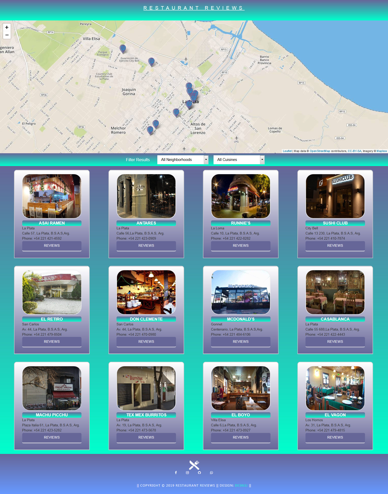

# restaurant-reviews-dc063j

* Project Restaurant Reviews  UDACITY

## Project Overview

For the Restaurant Reviews projects, you will incrementally convert a static webpage to a mobile-ready web application. In Stage One, you will take a static design that lacks accessibility and convert the design to be responsive on different sized displays and accessible for screen reader use. You will also begin converting this to a Progressive Web Application by caching some assets for offline use.

### Specification

* My project restaurant reviews was created with restaurants in the city of la plata, capital of Buenos Aires, modify the file restaurant.json and add the information with the reviews that appear on the internet
* also add a modal with 4 photos to give it some style, the photos were taken from http://shutterstock.com/
* the music of the index.html = Marshmello ft. Bastille
* the photos respect the origianl size of the project, I bought them using the web https://tinyjpg.com/

## How to run this app

* To start the restaurant reviews project, lift the python server by running the Server-python.bat file pointed python -m http.server 4019.
* with a browser place http: // localhost: 4019 / and access the project
* to clone the project go to <a href=https://github.com/diegocarrocera/Restaurant-reviews>click</a>

##### Screenshot Project

## Leaflet.js and Mapbox:

This repository uses [leafletjs](leafletjs.css) (leafletjs.js) with [Mapbox](https://www.mapbox.com/). mapboxToken: `<pk.eyJ1IjoiZGMwNjNqLXVkYWNpdHkiLCJhIjoiY2pzb3ltMXJmMDk4djQzcWdkejZwdzkxZSJ9.cppx3l-dyTTuBVKpHJXLZg>`  from [Mapbox](https://www.mapbox.com/)

#### Responsive project

* The restaurant reviews project is responsive on all devices.
  to do this create two css files called responsive.css for the index.html and responsive-rest.css for the restaurant info

* attached pictures of examples of some devices such as ipad, iphone, samsung s9 and generic devices

## Credits
* [music](Marshmello ft. Bastille.mp3)
* [leaflet](https://leafletjs.com/)
* [bootstrap](https://getbootstrap.com/docs/4.3/components/modal/)
* [color](https://www.w3schools.com/colors/colors_gradient.asp)
* [servivesworker](https://www.youtube.com/watch?v=TxXwlOAXUko)
* [servivesworker](https://developers.google.com/web/ilt/pwa/caching-files-with-service-worker)
* [picture](http://shutterstock.com/)
